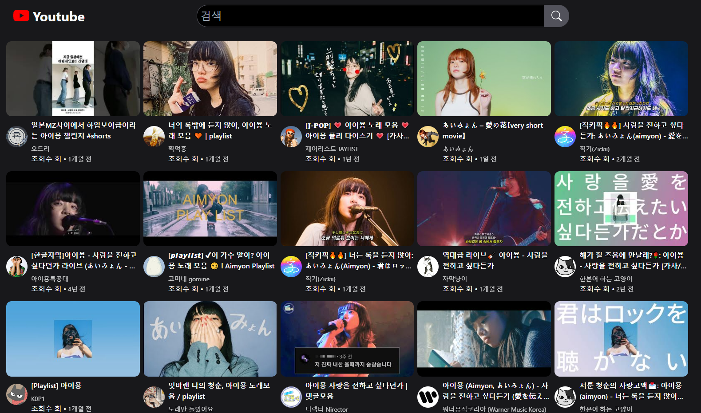
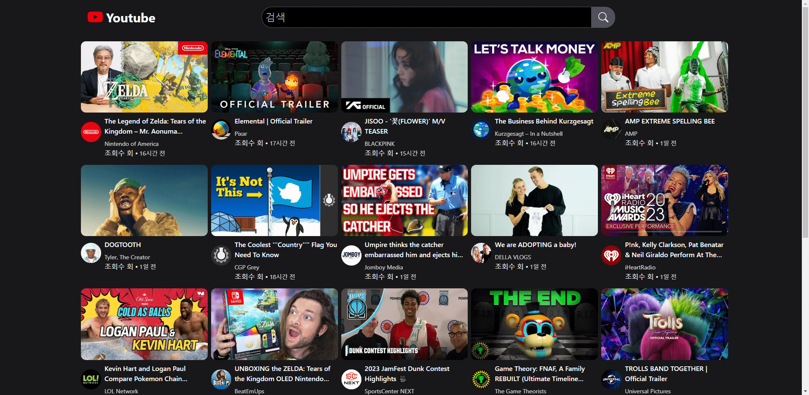

# 🎥 유튜브 클론코딩

 

**프로젝트 기간** : 2023.02.22 ~ 2023.03.02

[🔗사이트 둘러보기](https://incandescent-maamoul-efefa6.netlify.app/)
 

[🎬 시연영상](https://youtu.be/dt9TslezU-Y)

 

## ****✨ 프로젝트 개요****

- 본 프로젝트는 YouTube API를 활용하여 유튜브 클론 코딩 웹앱을 구현하는 것을 목적으로 합니다.
- React를 기반으로 프로젝트를 구현하며, YouTube API를 사용하여 동영상 검색, 재생, 최신 인기동영상 기능을 구현합니다.

 

## ****💻 기술 스택****
### Frontend
     

### Backend

 

|구분|사용 기술|
|:---:|:---:|
|UI|React|
|라우팅|React Router Dom|
|스타일링|TailWind CSS|
|아이콘|react-icons|
|API 연동|Axios|
|서버 상태 관리|React Query|
|Loading UI|react-loading-skeleton|

 

## ****🔍 주요 기능****
- 검색기능
- home페이지 최신인기동영상
- 동영상 재생
- 로딩중 skeletonUI 

 

